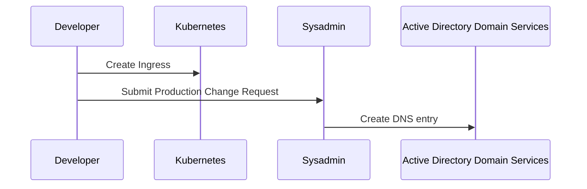
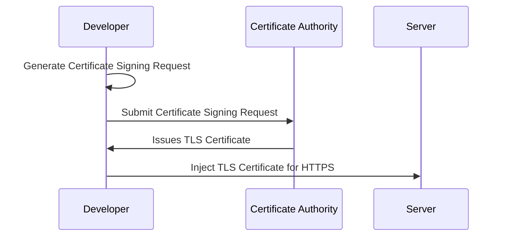

# DNS + Certificates

Automated generation of DNS A records and TLS certificates for multi-cluster Kubernetes

<div class="uppercase text-sm tracking-widest">
  Chua Song Ann
</div>


---
layout: center
class: text-center
---

# We don't enjoy manual work

<div class="flex items-center justify-center">
  
</div>


---

# Manual DNS Creation

<div class="flex items-center justify-center mt-20">

</div>


---

# Manual TLS Certificate Creation

<div class="flex items-center justify-center mt-15">

</div>


---
layout: center
class: text-center
---

# Let's automate it!

<div class="flex items-center justify-center">
  
</div>

---

# Architecture

<div class="flex items-center justify-center h-110">
<LightOrDark>
<template #dark>
```plantuml{scale: 0.8}
@startuml
skinparam {
  backgroundcolor transparent
  rectangle<<DUMMY>> {
    borderColor transparent
    stereotypeFontSize 0
    fontSize 0
  }
}
!include https://raw.githubusercontent.com/plantuml-stdlib/C4-PlantUML/master/C4_Context.puml
!include https://raw.githubusercontent.com/plantuml-stdlib/C4-PlantUML/master/C4_Deployment.puml

HIDE_STEREOTYPE()

UpdateBoundaryStyle($fontColor="#d2d4d2",$borderColor="#d2d4d2",$borderStyle="line")
UpdateRelStyle($textColor="#d2d4d2",$lineColor="#d2d4d2")
AddBoundaryTag("zone", $bgColor="#1f427a", $fontColor="white", $borderThickness="0")

Person(dev,"Developer",)
Boundary(a0,'Kubernetes Cluster' ){
  rectangle padding <<DUMMY>> {
    System(ingress,"Ingress-App")
    System(ext_dns,"External-DNS")
    System(cert_mgr,"Cert-Manager")
    System(acme_pod,"ACME Solver")
    System(acme_ing,"Ingress-ACME")
    Container(cert,"Cert-Secret")
  }
}
System(vra, "VMware vRealise Automation")
Boundary(b0,"Active Directory Domain Services") {
  rectangle padding2 <<DUMMY>> {
    Boundary(zone,"example.com","DNS Zone",$tags="zone"){
      Container(record,"app.example.com","'A' record")
    }
    Person_Ext(svc_acc,"Minimum permissible account",$sprite="robot")
  }
}
System(ca, "Smallstep","Intermediate Certificate Authority")

Rel_R(dev,vra,"Use  account  creation  catalog")
Rel(vra,svc_acc,"Creates  minimum  permissible  account")

Rel(dev,ingress,"Creates  Ingress-01")
Rel_R(ingress,ext_dns,"External-DNS  detects  new  ingress")
Rel(ingress,cert_mgr,"Cert-Manager  detects  new  ingress")

Rel_R(ext_dns,svc_acc,"Syncs  with  DNS  Zone  using  minimum  permissible  account")
Rel(svc_acc,record,"Creates  'A'  record")

BiRel_U(cert_mgr,ca,"Communicates  with  Intermediate  Certificate  Authority")
Rel(cert_mgr,acme_pod,"Creates  pod  hosting  HTTP-01  challenge")
Rel(cert_mgr,acme_ing,"Creates  HTTP-01  ingress")
Rel(ca,acme_ing,"Verifies  HTTP-01  challenge")
Rel_R(acme_ing,acme_pod,"")

Rel(cert_mgr,cert,"Creates  secret  containing  TLS  certificate")
Rel(ingress,cert,"Refers  to  secret  for  TLS  certificate")
@enduml
```
</template>
<template #light>
```plantuml{scale: 0.8}
@startuml
skinparam {
  backgroundcolor transparent
  rectangle<<DUMMY>> {
    borderColor transparent
    stereotypeFontSize 0
    fontSize 0
  }
}
!include https://raw.githubusercontent.com/plantuml-stdlib/C4-PlantUML/master/C4_Context.puml
!include https://raw.githubusercontent.com/plantuml-stdlib/C4-PlantUML/master/C4_Deployment.puml

HIDE_STEREOTYPE()

UpdateBoundaryStyle($borderStyle="line")
AddBoundaryTag("zone", $bgColor="#1f427a", $fontColor="white", $borderThickness="0")

Person(dev,"Developer",)
Boundary(a0,'Kubernetes Cluster' ){
  rectangle padding <<DUMMY>> {
    System(ingress,"Ingress-App")
    System(ext_dns,"External-DNS")
    System(cert_mgr,"Cert-Manager")
    System(acme_pod,"ACME Solver")
    System(acme_ing,"Ingress-ACME")
    Container(cert,"Cert-Secret")
  }
}
System(vra, "VMware vRealise Automation")
Boundary(b0,"Active Directory Domain Services") {
  rectangle padding2 <<DUMMY>> {
    Boundary(zone,"example.com","DNS Zone",$tags="zone"){
      Container(record,"app.example.com","'A' record")
    }
    Person_Ext(svc_acc,"Minimum permissible account",$sprite="robot")
  }
}
System(ca, "Smallstep","Intermediate Certificate Authority")

Rel_R(dev,vra,"Use  account  creation  catalog")
Rel(vra,svc_acc,"Creates  minimum  permissible  account")

Rel(dev,ingress,"Creates  Ingress-01")
Rel_R(ingress,ext_dns,"External-DNS  detects  new  ingress")
Rel(ingress,cert_mgr,"Cert-Manager  detects  new  ingress")

Rel_R(ext_dns,svc_acc,"Syncs  with  DNS  Zone  using  minimum  permissible  account")
Rel(svc_acc,record,"Creates  'A'  record")

BiRel_U(cert_mgr,ca,"Communicates  with  Intermediate  Certificate  Authority")
Rel(cert_mgr,acme_pod,"Creates  pod  hosting  HTTP-01  challenge")
Rel(cert_mgr,acme_ing,"Creates  HTTP-01  ingress")
Rel(ca,acme_ing,"Verifies  HTTP-01  challenge")
Rel_R(acme_ing,acme_pod,"")

Rel(cert_mgr,cert,"Creates  secret  containing  TLS  certificate")
Rel(ingress,cert,"Refers  to  secret  for  TLS  certificate")
@enduml
```
</template>
</LightOrDark>
</div>


---

# Components
<div class="mt-10"></div>

1. **Intermediate Certificate Authority**
    - Supports ACME protocol
    - Highly Available and Scalable

2. **TLS Certificates**
    - Supports ACME protocol
    - Automatically request TLS certificates based on Ingress records
    - Automatically renew TLS certificates when nearing expiry


---

# Components
<div class="mt-10"></div>

3. **DNS Records**
    - Automatically synchronize DNS records with Ingress records
    - Includes permissions and ownership to prevent overwriting of resources
    - Narrowing blast-radius of allowing zone-transfer by restricting to specific delegated zone for a specific IP range
    - Zone domain name should accommodate AuthMS token cookie to be loaded in the browser

4. **Configuration management at scale**
    - Push down configuration to individual clusters in an automated fashion
