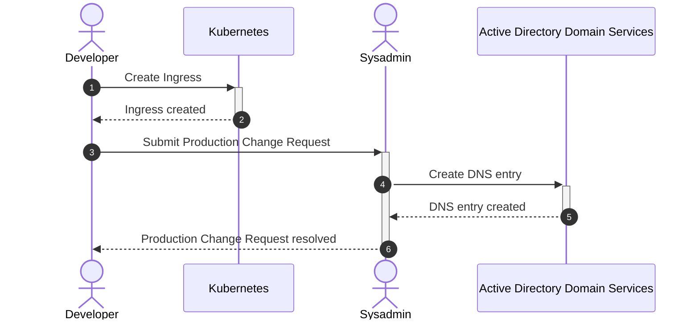
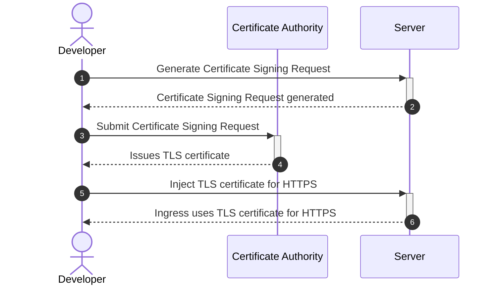
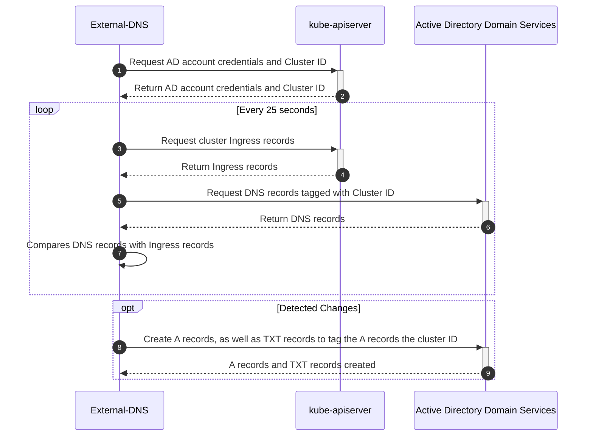
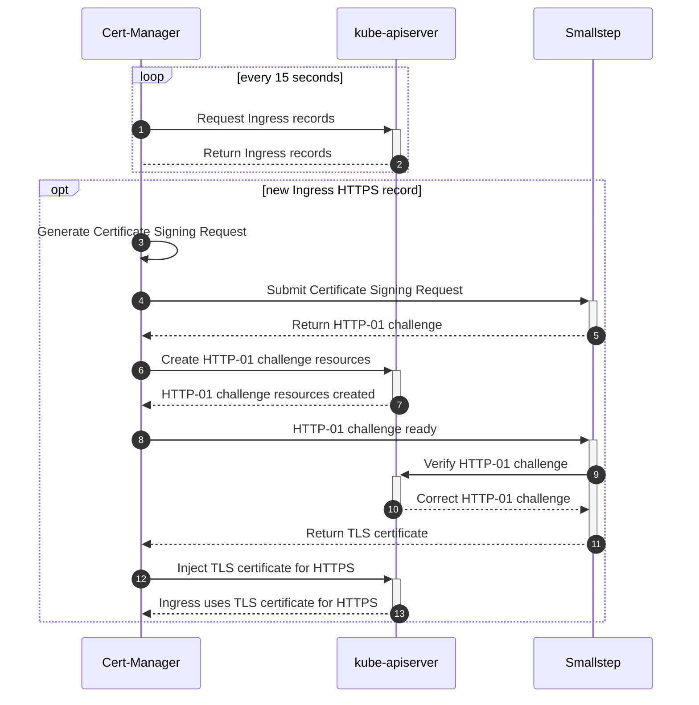

# DNS + Certificates

Automated generation of DNS A records and TLS certificates for multi-cluster Kubernetes

<div class="uppercase text-sm tracking-widest">
  Chua Song Ann
</div>


---
layout: center
class: text-center
---

# We don't enjoy manual work

<div class="flex items-center justify-center">
  
</div>


---

# Manual DNS Creation

<div class="flex items-center justify-center mt-20">

</div>


---

# Manual TLS Certificate Creation

<div class="flex items-center justify-center mt-15">

</div>


---
layout: center
class: text-center
---

# Let's automate it!

<div class="flex items-center justify-center">
  
</div>

---

# Architecture

<div class="flex items-center justify-center h-100">
<LightOrDark>
  <template #light>

```plantuml{scale: 0.85}
@startuml
skinparam {
  backgroundcolor transparent
  rectangle<<DUMMY>> {
    borderColor transparent
    stereotypeFontSize 0
    fontSize 0
  }
}
!include https://raw.githubusercontent.com/plantuml-stdlib/C4-PlantUML/master/C4_Context.puml
!include https://raw.githubusercontent.com/plantuml-stdlib/C4-PlantUML/master/C4_Deployment.puml

HIDE_STEREOTYPE()

UpdateBoundaryStyle($borderStyle="line")
AddBoundaryTag("zone", $bgColor="#1f427a", $fontColor="white", $borderThickness="0")

Person(dev,"Developer",)
Boundary(a0,'Kubernetes Cluster' ){
  rectangle padding <<DUMMY>> {
    Container(ingress,"Ingress-App","Ingress")
    System(ext_dns,"External-DNS")
    System(cert_mgr,"Cert-Manager")
    Container(acme_pod,"ACME Solver","Pod")
    Container(acme_ing,"Ingress-ACME","Ingress")
    Container(cert,"Cert-Secret","Secret")
  }
}
System(vra, "VMware vRealise Automation")
Boundary(b0,"Active Directory Domain Services") {
  rectangle padding2 <<DUMMY>> {
    Boundary(zone,"example.com","DNS Zone",$tags="zone"){
      Container(record,"app.example.com","A record")
    }
    Person_Ext(svc_acc,"Minimum permissible account",$sprite="robot")
  }
}
System(ca, "Smallstep","Intermediate Certificate Authority")

Rel_R(dev,vra,"Use  account  creation  catalog")
Rel(vra,svc_acc,"Creates  minimum  permissible  account")
Rel(dev,ingress,"Creates  Ingress-App")
Rel_R(ingress,ext_dns,"External-DNS  detects  new  ingress")
Rel_D(ingress,cert_mgr,"Cert-Manager  detects  new  ingress")
Rel_R(ext_dns,svc_acc,"Syncs  with  DNS  Zone  using  minimum  permissible  account")
Rel_D(svc_acc,record,"Creates  A  record")
BiRel_L(cert_mgr,ca,"Communicates  with  Intermediate  Certificate  Authority")
Rel(cert_mgr,acme_pod,"Creates  pod  hosting  HTTP-01  challenge")
Rel_D(cert_mgr,acme_ing,"Creates  HTTP-01  ingress")
Rel(ca,acme_ing,"Verifies  HTTP-01  challenge")
Rel_R(acme_ing,acme_pod,"")
Rel_R(cert_mgr,cert,"Creates  secret  containing  TLS  certificate")
Rel(ingress,cert,"Refers  to  secret  for  TLS  certificate")
@enduml
```

  </template>
  <template #dark>

```plantuml{scale: 0.85}
@startuml
skinparam {
  backgroundcolor transparent
  rectangle<<DUMMY>> {
    borderColor transparent
    stereotypeFontSize 0
    fontSize 0
  }
}
!include https://raw.githubusercontent.com/plantuml-stdlib/C4-PlantUML/master/C4_Context.puml
!include https://raw.githubusercontent.com/plantuml-stdlib/C4-PlantUML/master/C4_Deployment.puml

HIDE_STEREOTYPE()

UpdateBoundaryStyle($fontColor="#d2d4d2",$borderColor="#d2d4d2",$borderStyle="line")
UpdateRelStyle($textColor="#d2d4d2",$lineColor="#d2d4d2")
AddBoundaryTag("zone", $bgColor="#1f427a", $fontColor="white", $borderThickness="0")
AddSystemTag("highlight",$bgColor="#17a348",$borderColor="#0f6e30")

Person(dev,"Developer",)
Boundary(a0,'Kubernetes Cluster' ){
  rectangle padding <<DUMMY>> {
    Container(ingress,"Ingress-App","Ingress")
    System(ext_dns,"External-DNS",$tags="highlight")
    System(cert_mgr,"Cert-Manager",$tags="highlight")
    Container(acme_pod,"ACME Solver","Pod")
    Container(acme_ing,"Ingress-ACME","Ingress")
    Container(cert,"Cert-Secret","Secret")
  }
}
System(vra, "VMware vRealise Automation")
Boundary(b0,"Active Directory Domain Services") {
  rectangle padding2 <<DUMMY>> {
    Boundary(zone,"example.com","DNS Zone",$tags="zone"){
      Container(record,"app.example.com","A record")
    }
    Person_Ext(svc_acc,"Minimum permissible account",$sprite="robot")
  }
}
System(ca, "Smallstep","Intermediate Certificate Authority")

Rel_R(dev,vra,"Use  account  creation  catalog")
Rel(vra,svc_acc,"Creates  minimum  permissible  account")
Rel(dev,ingress,"Creates  Ingress-App")
Rel_R(ingress,ext_dns,"External-DNS  detects  new  ingress")
Rel_D(ingress,cert_mgr,"Cert-Manager  detects  new  ingress")
Rel_R(ext_dns,svc_acc,"Syncs  with  DNS  Zone  using  minimum  permissible  account")
Rel_D(svc_acc,record,"Creates  A  record")
BiRel_L(cert_mgr,ca,"Communicates  with  Intermediate  Certificate  Authority")
Rel(cert_mgr,acme_pod,"Creates  pod  hosting  HTTP-01  challenge")
Rel_D(cert_mgr,acme_ing,"Creates  HTTP-01  ingress")
Rel(ca,acme_ing,"Verifies  HTTP-01  challenge")
Rel_R(acme_ing,acme_pod,"")
Rel_R(cert_mgr,cert,"Creates  secret  containing  TLS  certificate")
Rel(ingress,cert,"Refers  to  secret  for  TLS  certificate")
@enduml
```

  </template>
</LightOrDark>
</div>


---
layout: statement
---

# No native multi-cluster support

External-DNS is built for single-cluster use-cases


---

# Multi-cluster External-DNS
<span></span>

We control External-DNS's access to Active Directory on 2 levels

<br/>

1. **Cluster ID** — A unique text tagged to DNS records created, to identify the owner of the DNS record

    - Automatically created in the format `supervisor_namespace`-`cluster_name` when cluster is onboarded to Rancher Dashboard

<br/>

2. **AD account credentials** — Required for External-DNS to be able to create and modify DNS records

    - Minimum permissible account created through VMware vRealize Automation


---

# Automated multi-cluster DNS Creation

<div class="flex items-center justify-center">

</div>


---
layout: center
class: text-center
---

<div class="flex items-center justify-center">
  
</div>


---

# What is ACME?

- Automated Certificate Management Environment
- Protocol for automatic validation and issuance of certificates from a Certificate Authority
- No human interaction required

<br>

### Summarized steps:
1. The agent proves to the Certificate Authority that the webserver controls a domain
2. The agent then can proceed to request, renew, and revoke certificates for that domain


---
layout: center
class: text-center
---

# HTTP-01 Example

<div class="flex items-center justify-center">
  
</div>


---

# Possible choices

### ACME-ACDS-Server
- Enables installing ACME-ACDS as a website in Windows Server Active Directory to enable ACME certificate requests from Windows Server Active Directory Certificate Services
- Hobby project with no enterprise level support
- <span style="color: #fa4b4b">Installing custom components in Active Directory may lead to downstream issues with patching/upgrading</span>


<br>

### Vault
- Generic secrets management product
- Does not have ACME support
- <span style="color: #fa4b4b">Need to solve the bottom turtle problem ("Secret Zero")</span>


---

# What we chose

### Smallstep
- Specialised Intermediate Certificate Authority to issue certificates
- Supports ACME protocol HTTP-01 challenge
- Templates to customise certificate fields for Subject Alternative Names
- Plays well with Cert-Manager
- No sensitive data stored in the database
- Certificate Authority signing key is encrypted at disk


---

# Certificate Lifetime

- Certificates should be short-lived
- Reduce ecosystem reliance on "broken" revocation checking solutions that cannot fail-closed
  - If revocation check response does not come back, the browser simply forgets about it
  - Chrome doesn't even do revocation checks
- **90-days validity** follows best practices from Lets Encrypt and Google

---

# Smallstep deployment

<div class="flex items-center justify-center h-80">
<LightOrDark>
  <template #light>

```plantuml{scale: 0.7}
@startuml
skinparam {
  backgroundcolor transparent
  rectangle<<DUMMY>> {
    borderColor transparent
    stereotypeFontSize 0
    fontSize 0
  }
}
!include https://raw.githubusercontent.com/plantuml-stdlib/C4-PlantUML/master/C4_Context.puml
!include https://raw.githubusercontent.com/plantuml-stdlib/C4-PlantUML/master/C4_Deployment.puml

HIDE_STEREOTYPE()

UpdateBoundaryStyle($borderStyle="line")

Boundary(a0,'Kubernetes Cluster' ){
  rectangle padding <<DUMMY>> {
    Container(stepca_ing,"Step-CA","Ingress")
    Container(stepca_svc,"Step-CA", "Service")
    Container(stepca_pod,"Step-CA", "Pods")
    Container(cnpg_svc,"CloudNativePG","Service")
    Container(cnpg_pod,"CloudNativePG","Pods")
    Container(checker,"Cert-Checker","K8s CronJob")
  }
}
Boundary(b0,'Kubernetes Cluster' ){
}
System(s3, "S3")
System(mm, "Mattermost")

Rel(b0,stepca_ing,"")
Rel_L(stepca_ing,stepca_svc,"")
Rel_L(stepca_svc,stepca_pod,"")
Rel_D(stepca_pod,cnpg_svc,"")
Rel_L(cnpg_svc,cnpg_pod,"")
Rel_R(cnpg_svc,checker,"")
Rel_L(cnpg_pod,s3,"")
Rel_R(checker,mm,"")
@enduml
```

  </template>
  <template #dark>

```plantuml{scale: 0.7}
@startuml
skinparam {
  backgroundcolor transparent
  rectangle<<DUMMY>> {
    borderColor transparent
    stereotypeFontSize 0
    fontSize 0
  }
}
!include https://raw.githubusercontent.com/plantuml-stdlib/C4-PlantUML/master/C4_Context.puml
!include https://raw.githubusercontent.com/plantuml-stdlib/C4-PlantUML/master/C4_Deployment.puml

HIDE_STEREOTYPE()

UpdateBoundaryStyle($fontColor="#d2d4d2",$borderColor="#d2d4d2",$borderStyle="line")
UpdateRelStyle($textColor="#d2d4d2",$lineColor="#d2d4d2")

Boundary(a0,'Kubernetes Cluster' ){
  rectangle padding <<DUMMY>> {
    Container(stepca_ing,"Step-CA","Ingress")
    Container(stepca_svc,"Step-CA", "Service")
    Container(stepca_pod,"Step-CA", "Pods")
    Container(cnpg_svc,"CloudNativePG","Service")
    Container(cnpg_pod,"CloudNativePG","Pods")
    Container(checker,"Cert-Checker","K8s CronJob")
  }
}
Boundary(b0,'Kubernetes Cluster' ){
}
System(s3, "S3")
System(mm, "Mattermost")

Rel(b0,stepca_ing,"")
Rel_L(stepca_ing,stepca_svc,"")
Rel_L(stepca_svc,stepca_pod,"")
Rel_D(stepca_pod,cnpg_svc,"")
Rel_L(cnpg_svc,cnpg_pod,"")
Rel_R(cnpg_svc,checker,"")
Rel_L(cnpg_pod,s3,"Daily  backups")
Rel_R(checker,mm,"Alert  if  certificates  expiring  and  not  renewed")
@enduml
```

  </template>
</LightOrDark>
</div>


---

## Automated TLS Certificate Creation

<div class="flex items-center justify-center mt-3">

</div>


---
layout: center
class: text-center
---

<div class="flex items-center justify-center">
  
</div>


---

# GitOps for Configuration Management at Scale

- Git as the single source of truth
- Pull-based approach — don't need to expose kubeconfig secrets
- Distributed initialisation system that makes it easy to customize applications and manage clusters from a single point
<div class="flex items-center justify-center mt-10">
  
</div>


---

# Another look at the architecture

<div class="flex items-center justify-center h-100">
<LightOrDark>
  <template #light>

```plantuml{scale: 0.85}
@startuml
skinparam {
  backgroundcolor transparent
  rectangle<<DUMMY>> {
    borderColor transparent
    stereotypeFontSize 0
    fontSize 0
  }
}
!include https://raw.githubusercontent.com/plantuml-stdlib/C4-PlantUML/master/C4_Context.puml
!include https://raw.githubusercontent.com/plantuml-stdlib/C4-PlantUML/master/C4_Deployment.puml

HIDE_STEREOTYPE()

UpdateBoundaryStyle($borderStyle="line")
AddBoundaryTag("zone", $bgColor="#1f427a", $fontColor="white", $borderThickness="0")

Person(dev,"Developer",)
Boundary(a0,'Kubernetes Cluster' ){
  rectangle padding <<DUMMY>> {
    Container(ingress,"Ingress-App","Ingress")
    System(ext_dns,"External-DNS")
    System(cert_mgr,"Cert-Manager")
    Container(acme_pod,"ACME Solver","Pod")
    Container(acme_ing,"Ingress-ACME","Ingress")
    Container(cert,"Cert-Secret","Secret")
  }
}
System(vra, "VMware vRealise Automation")
Boundary(b0,"Active Directory Domain Services") {
  rectangle padding2 <<DUMMY>> {
    Boundary(zone,"example.com","DNS Zone",$tags="zone"){
      Container(record,"app.example.com","A record")
    }
    Person_Ext(svc_acc,"Minimum permissible account",$sprite="robot")
  }
}
System(ca, "Smallstep","Intermediate Certificate Authority")

Rel_R(dev,vra,"Use  account  creation  catalog")
Rel(vra,svc_acc,"Creates  minimum  permissible  account")
Rel(dev,ingress,"Creates  Ingress-App")
Rel_R(ingress,ext_dns,"External-DNS  detects  new  ingress")
Rel_D(ingress,cert_mgr,"Cert-Manager  detects  new  ingress")
Rel_R(ext_dns,svc_acc,"Syncs  with  DNS  Zone  using  minimum  permissible  account")
Rel_D(svc_acc,record,"Creates  A  record")
BiRel_L(cert_mgr,ca,"Communicates  with  Intermediate  Certificate  Authority")
Rel(cert_mgr,acme_pod,"Creates  pod  hosting  HTTP-01  challenge")
Rel_D(cert_mgr,acme_ing,"Creates  HTTP-01  ingress")
Rel(ca,acme_ing,"Verifies  HTTP-01  challenge")
Rel_R(acme_ing,acme_pod,"")
Rel_R(cert_mgr,cert,"Creates  secret  containing  TLS  certificate")
Rel(ingress,cert,"Refers  to  secret  for  TLS  certificate")
@enduml
```

  </template>
  <template #dark>

```plantuml{scale: 0.85}
@startuml
skinparam {
  backgroundcolor transparent
  rectangle<<DUMMY>> {
    borderColor transparent
    stereotypeFontSize 0
    fontSize 0
  }
}
!include https://raw.githubusercontent.com/plantuml-stdlib/C4-PlantUML/master/C4_Context.puml
!include https://raw.githubusercontent.com/plantuml-stdlib/C4-PlantUML/master/C4_Deployment.puml

HIDE_STEREOTYPE()

UpdateBoundaryStyle($fontColor="#d2d4d2",$borderColor="#d2d4d2",$borderStyle="line")
UpdateRelStyle($textColor="#d2d4d2",$lineColor="#d2d4d2")
AddBoundaryTag("zone", $bgColor="#1f427a", $fontColor="white", $borderThickness="0")
AddSystemTag("highlight",$bgColor="#17a348",$borderColor="#0f6e30")

Person(dev,"Developer",)
Boundary(a0,'Kubernetes Cluster' ){
  rectangle padding <<DUMMY>> {
    Container(ingress,"Ingress-App","Ingress")
    System(ext_dns,"External-DNS",$tags="highlight")
    System(cert_mgr,"Cert-Manager",$tags="highlight")
    Container(acme_pod,"ACME Solver","Pod")
    Container(acme_ing,"Ingress-ACME","Ingress")
    Container(cert,"Cert-Secret","Secret")
  }
}
System(vra, "VMware vRealise Automation")
Boundary(b0,"Active Directory Domain Services") {
  rectangle padding2 <<DUMMY>> {
    Boundary(zone,"example.com","DNS Zone",$tags="zone"){
      Container(record,"app.example.com","A record")
    }
    Person_Ext(svc_acc,"Minimum permissible account",$sprite="robot")
  }
}
System(ca, "Smallstep","Intermediate Certificate Authority")

Rel_R(dev,vra,"Use  account  creation  catalog")
Rel(vra,svc_acc,"Creates  minimum  permissible  account")
Rel(dev,ingress,"Creates  Ingress-App")
Rel_R(ingress,ext_dns,"External-DNS  detects  new  ingress")
Rel_D(ingress,cert_mgr,"Cert-Manager  detects  new  ingress")
Rel_R(ext_dns,svc_acc,"Syncs  with  DNS  Zone  using  minimum  permissible  account")
Rel_D(svc_acc,record,"Creates  A  record")
BiRel_L(cert_mgr,ca,"Communicates  with  Intermediate  Certificate  Authority")
Rel(cert_mgr,acme_pod,"Creates  pod  hosting  HTTP-01  challenge")
Rel_D(cert_mgr,acme_ing,"Creates  HTTP-01  ingress")
Rel(ca,acme_ing,"Verifies  HTTP-01  challenge")
Rel_R(acme_ing,acme_pod,"")
Rel_R(cert_mgr,cert,"Creates  secret  containing  TLS  certificate")
Rel(ingress,cert,"Refers  to  secret  for  TLS  certificate")
@enduml
```

  </template>
</LightOrDark>
</div>


---
layout: section
---

# Thank you
<div class="flex items-center justify-center">
  
</div>